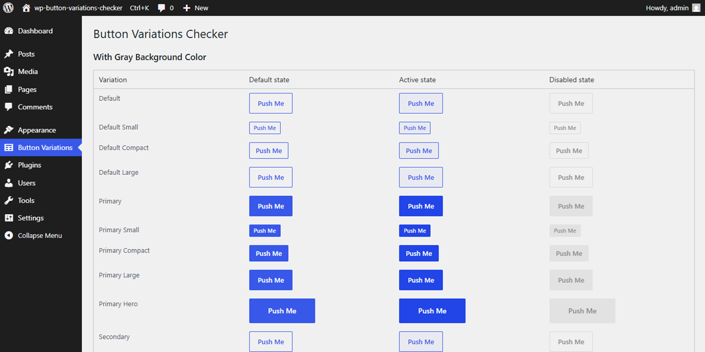

# WP Button Variations Checker

A WordPress plugin to visually verify button design variations in bulk. Created to support work on [WordPress Core Trac #64308](https://core.trac.wordpress.org/ticket/64308) — Explore a "Coat-of-Paint" Visual Reskin of the WordPress Admin.

## Playground

[Open in WordPress Playground](https://playground.wordpress.net/?blueprint-url=https://raw.githubusercontent.com/t-hamano/wp-button-variations-checker/main/.wordpress-playground/blueprint.json)